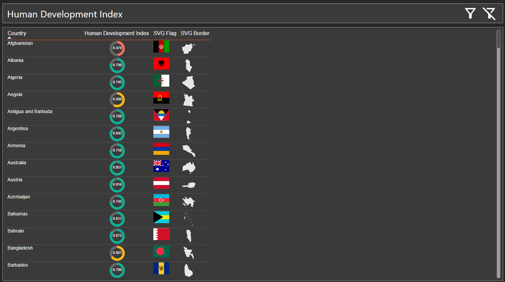

SVG Repo
========

Welcome to the **SVG Repo**, a collection designed to showcase different uses of SVG in Power BI.

Table of Contents
-----------------

- [SVG Repo](#svg-repo)
  - [Table of Contents](#table-of-contents)
  - [Repository Structure](#repository-structure)
  - [Acknowledgements](#acknowledgements)
  - [Power BI Report](#power-bi-report)
    - [Visualizations and Measures](#visualizations-and-measures)
      - [Human Development Index Donut Chart](#human-development-index-donut-chart)
    - [Power Query Transformations](#power-query-transformations)
      - [Parameters](#parameters)
      - [Queries](#queries)
  - [Python Scripts](#python-scripts)
    - [`json_to_df_builder.py`](#json_to_df_builderpy)
    - [`extract_map.py`](#extract_mappy)
  - [Getting Started](#getting-started)
    - [Prerequisites](#prerequisites)
    - [Usage](#usage)

* * * * *

Repository Structure
--------------------

-   **borders/**\
    A folder containing SVG files of country borders, generated by the `extract_map.py` script.\
    **Source:** [SimpleMaps SVG World Map](https://simplemaps.com/resources/svg-world)

-   **flags/**\
    A folder containing SVG files of country flags.\
    **Source:** [Flag Icons by Lipis](https://github.com/lipis/flag-icons)

-   **data/**\
    Contains data files used in the Power BI report:

    -   `countries.xlsx`: Country information.
    -   `human-development-index.csv`: Human Development Index data by country and year.\
        **Source:** [UNDP Human Development Report (2021-22)](https://hdr.undp.org/sites/default/files/2021-22_HDR/hdr2021-22_technical_notes.pdf)
-   **Power BI SVGs/**\
    A collection of Power BI-related SVGs, including icons for semantic models, reports, paginated reports, and other Microsoft Fabric items.

-   **Power BI Report Files/**\
    Contains the Power BI report and related files:

    -   `SVGs in Power BI.Report`
    -   `SVGs in Power BI.SemanticModel`
    -   `SVGs in Power BI`

* * * * *

Acknowledgements
----------------

-   **Country Borders SVGs:**\
    The country border SVGs were sourced from [SimpleMaps SVG World Map](https://simplemaps.com/resources/svg-world).\

-   **Country Flags SVGs:**\
    The country flag SVGs were sourced from [Flag Icons by Lipis](https://github.com/lipis/flag-icons).\

-   **Human Development Index Data:**\
    The HDI data was obtained from the [UNDP Human Development Report (2021-22)](https://hdr.undp.org/sites/default/files/2021-22_HDR/hdr2021-22_technical_notes.pdf).\

* * * * *

Power BI Report
---------------

The Power BI report included in this repository demonstrates how SVG images can be integrated into Power BI.

### Visualizations and Measures

#### Human Development Index Donut Chart

The report features a custom donut chart visualization for the Human Development Index (HDI) of each country. This visualization is created using an SVG image generated by a DAX measure.

**DAX Measure: `Donut Chart`**

<pre>
Donut Chart =
VAR HDI_Value = [Human Development Index] // The measure that will be used
VAR radius = 16 // Radius of the donut chart
VAR strokeWidth = 6  // Width of the chart
VAR backgroundColor = "%23686868"  // Unfilled background color of the donut
VAR textColor = "%23ffffff" // White text color for contrast (encoded '#' as '%23')

/* Conditional color logic for the donut chart */
VAR foregroundColor =
    IF(HDI_Value < 0.55, "%23FF6F61", // Red for low HDI (< 0.55)
    IF(HDI_Value < 0.70, "%23FCB714",  // Yellow for medium HDI (0.55 <= HDI < 0.70)
    "%230EB194")) // Green for high HDI (>= 0.70)

VAR circumference = 2 * PI() * radius
VAR strokeDasharray = circumference
VAR strokeDashoffset = circumference * (1 - HDI_Value)

VAR svg =
    "data:image/svg+xml;utf8,<svg width='40' height='40' viewBox='0 0 40 40' xmlns='http://www.w3.org/2000/svg'>
        <circle cx='20' cy='20' r='" & radius & "' stroke='" & backgroundColor & "' fill='none' stroke-width='" & strokeWidth & "'/>
        <circle cx='20' cy='20' r='" & radius & "' stroke='" & foregroundColor & "' fill='none' stroke-width='" & strokeWidth & "'
            stroke-dasharray='" & strokeDasharray & "'
            stroke-dashoffset='" & strokeDashoffset & "'
            transform='rotate(-90 20 20)'/>
        <text x='20' y='22' text-anchor='middle' font-size='9' fill='" & textColor & "' font-family='Arial'>" & FORMAT(HDI_Value, "0.000") & "</text>
    </svg>"

RETURN IF(ISBLANK(HDI_Value), BLANK(), svg) </pre>

**Description:**

-   The measure calculates the HDI value and creates an SVG donut chart representing the HDI score for each country.
-   The chart color changes based on the HDI value:
    -   **Red** for low HDI (< 0.55)
    -   **Yellow** for medium HDI (0.55 ≤ HDI < 0.70)
    -   **Green** for high HDI (≥ 0.70)
-   The HDI value is displayed at the center of the donut chart.
-   Impoortant to mark the data category of the measure as ***Image URL***

### Power Query Transformations

#### Parameters

-   **FolderPath**\
    A parameter that specifies the path to the data folder.\
    **Update this parameter if you clone the repository to match your local directory structure.**

#### Queries

1.  **`dCountries`**\
    Merges country data with flag and border SVGs, splitting the SVG content into parts to handle Power BI's character limit per value (32,767 characters).

2.  **`dCountriesflags`**\
    Reads flag SVGs from the JSON file and prepares them for merging.

3.  **`borders`**\
    Reads border SVGs from the JSON file.

4.  **`fHDI`**\
    Imports and cleans the Human Development Index data.

   
* * * * *

Python Scripts
--------------

The repository includes Python scripts used to generate and process SVG files.

### `json_to_df_builder.py`

This script reads SVG files from a specified folder and converts them into a JSON file containing a DataFrame with the file names and SVG content.

**Usage:**

-   Update the `folder_path` variable to point to the folder containing the SVG files (`borders` or `flags`).
-   Run the script to generate a JSON file in the `data/` folder.

### `extract_map.py`

This script processes an SVG world map file and extracts individual country borders, saving them as separate SVG files with their corresponding ISO2 country codes.

**Key Features:**

-   Parses the world SVG file (`world.svg`) using `BeautifulSoup` and `svgpathtools`.
-   Assigns ISO2 codes to countries based on their `class` attributes.
-   Saves each country's border as an individual SVG file in the `borders/` folder.

**Dependencies:**

-   `BeautifulSoup`
-   `svgpathtools`
-   `collections`

**Acknowledgement:**

-   The world map SVG used as input is sourced from [SimpleMaps SVG World Map](https://simplemaps.com/resources/svg-world).

* * * * *

Getting Started
---------------

### Prerequisites

-   **Power BI Desktop** installed on your machine.
-   **Python 3.x** installed (for running the Python scripts).
-   Required Python packages:
    -   `pandas`
    -   `beautifulsoup4`
    -   `svgpathtools`

### Usage

1.  **Clone the Repository:**

2.  **Update the Folder Path in Power BI:**

    -   Open the Power BI report file (`SVGs in Power BI.pbix`).
    -   Go to `Transform Data` > `Edit Parameters`.
    -   Update the `FolderPath` parameter to match the path where you cloned the repository.
3.  **Run the Python Scripts (Optional):**

    -   If you need to regenerate the JSON files or SVGs, navigate to the repository directory.

4.  **Refresh the Power BI Report:**

    -   After updating the `FolderPath` and running the scripts (if necessary), refresh the data in Power BI to load the latest information.